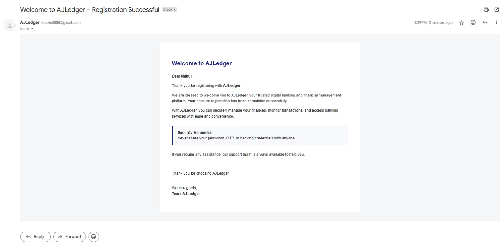
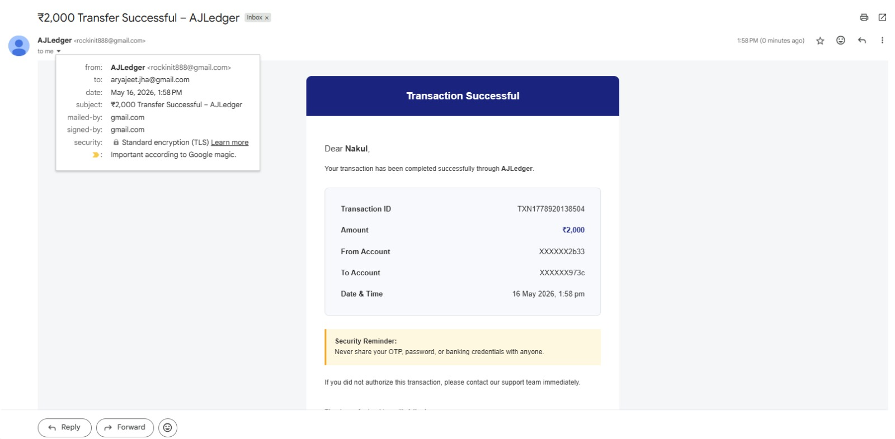

# BankingSystem

A banking ledger API built with Node.js, Express, and MongoDB. Covers real-world financial system patterns that most tutorials skip — double-entry bookkeeping, idempotent payments, atomic transactions, and an immutable audit trail.

> **On the name "Nakul":** It's a placeholder alias used throughout the project. Just an old habit of not putting real names online — didn't feel like changing it after the fact.

---

## Features

### Authentication
- User registration and login with JWT tokens stored in HTTP-only cookies
- Password hashing with bcrypt
- Protected routes via auth middleware
- Token blacklisting on logout

### Double-Entry Ledger System
- Balances are never stored directly — they're always derived from ledger entries using a MongoDB aggregation pipeline
- Every transaction creates exactly one `DEBIT` entry and one `CREDIT` entry
- Mirrors how real-world banks track money

### Immutable Ledger Entries
- Ledger documents, once written, can never be updated or deleted
- Enforced at the Mongoose schema level by intercepting all mutation hooks (`findOneAndUpdate`, `deleteOne`, `updateMany`, etc.)
- Guarantees a tamper-proof audit trail

### Atomic Transactions with Mongoose Sessions
- Fund transfers wrap all DB writes in a single MongoDB session
- If anything fails mid-transfer, the entire operation rolls back
- No partial states — all or nothing

### Idempotency Keys
- Every transaction requires a unique `idempotencyKey` from the client
- Prevents accidental double-charges if a request is retried
- Returns the existing transaction state if the key is already known

### Email Notifications via Gmail OAuth2
- Welcome email on registration
- Transaction confirmation email after every successful transfer
- Integrated with Nodemailer using Gmail OAuth2, not plain credentials

### Multi-Account Support
- Users can hold multiple accounts
- Each account has a status: `ACTIVE`, `FROZEN`, or `CLOSED`
- Transactions only proceed when both sender and receiver accounts are `ACTIVE`

---

## Tech Stack

| Layer | Technology |
|---|---|
| Runtime | Node.js |
| Framework | Express v5 |
| Database | MongoDB Atlas + Mongoose |
| Auth | JWT + bcrypt |
| Email | Nodemailer + Gmail OAuth2 |
| Dev | nodemon |

---

## Folder Structure

```
BankingSystem/
├── server.js
└── src/
    ├── app.js                     # Express app setup
    ├── config/
    │   └── db.js                  # MongoDB connection
    ├── models/
    │   ├── user.model.js
    │   ├── account.model.js       # getBalance() via aggregation pipeline
    │   ├── transaction.model.js
    │   ├── ledger.model.js        # Immutable entries enforced here
    │   └── blackList.js           # JWT blacklist for logout
    ├── routes/
    │   ├── auth.routes.js
    │   ├── account.routes.js
    │   └── transaction.routes.js
    ├── controllers/
    │   ├── auth.controller.js
    │   ├── account.controller.js
    │   └── transaction.controller.js
    ├── middlewares/
    │   └── auth.middleware.js
    └── services/
        └── email.service.js
```

---

## Getting Started

### Prerequisites
- Node.js v18+
- MongoDB Atlas account
- Gmail account with OAuth2 credentials

### Installation

```bash
git clone https://github.com/your-username/BankingSystem.git
cd BankingSystem
npm install
```

### Environment Variables

Create a `.env` file in the root:

```env
PORT=3000
MONGO_URI=your_mongodb_atlas_connection_string
JWT_SECRET=your_jwt_secret

# Gmail OAuth2
GMAIL_CLIENT_ID=your_client_id
GMAIL_CLIENT_SECRET=your_client_secret
GMAIL_REFRESH_TOKEN=your_refresh_token
GMAIL_USER=your_email@gmail.com
```

### Run

```bash
# Development
npm run dev

# Production
npm start
```

---

## API Endpoints

### Auth
| Method | Route | Description |
|---|---|---|
| POST | `/api/auth/register` | Register a new user |
| POST | `/api/auth/login` | Login and receive JWT cookie |
| POST | `/api/auth/logout` | Logout and blacklist token |

### Accounts
| Method | Route | Description |
|---|---|---|
| POST | `/api/account/create` | Create a new bank account |
| GET | `/api/account/balance/:id` | Get current balance (computed from ledger) |

### Transactions
| Method | Route | Description |
|---|---|---|
| POST | `/api/transaction/transfer` | Transfer funds between accounts |
| POST | `/api/transaction/fund` | Add initial funds via system account |

---

## How Balance Calculation Works

Balances are never stored as a field. They're computed on demand from ledger entries using a MongoDB aggregation pipeline:

```
Balance = Sum of all CREDIT entries - Sum of all DEBIT entries
```

This keeps the balance consistent with the actual transaction history at all times, even if something fails mid-transfer.

---

## Transaction Flow

```
1. Validate request fields
2. Check idempotency key — return early if already processed
3. Verify both accounts exist and are ACTIVE
4. Derive sender balance from ledger aggregation
5. Check sufficient balance
6. Start MongoDB session
   - Create Transaction (PENDING)
   - Write DEBIT ledger entry (sender)
   - Write CREDIT ledger entry (receiver)
   - Mark Transaction as COMPLETED
7. Commit session
8. Send transaction email notification
```

---

## Known Areas for Improvement

- `createTransaction` is ~150 lines — balance check, ledger writes, and status update should be extracted into service functions
- No centralized error handler middleware
- No input validation (Joi or Zod would fit well here)
- No rate limiting
- No structured logging (Winston or Pino)
- No test suite
- No API documentation (Swagger/OpenAPI)

---

## Email Notifications

The system sends real emails through Gmail OAuth2. Screenshots of the welcome and transaction emails are included in the repo.






---

## License

ISC